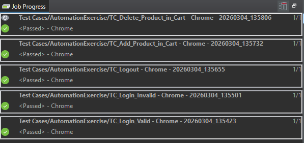
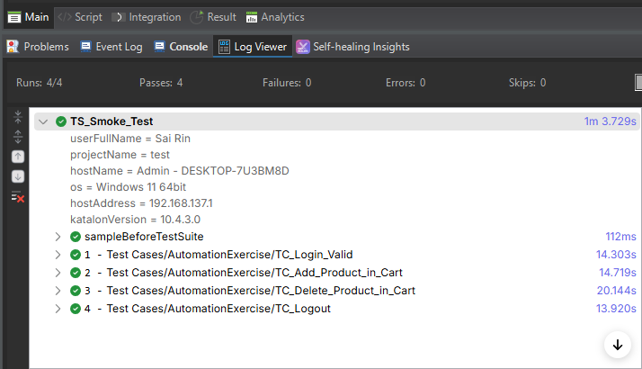
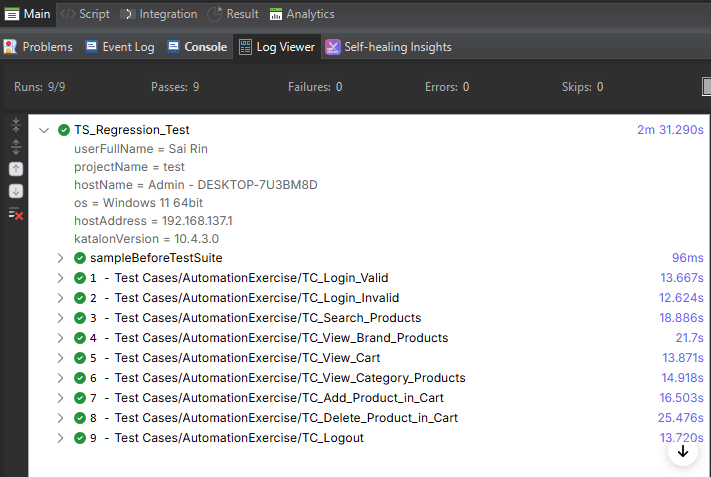

# 🧪 Katalon Web Automation Testing

Automation testing project using Katalon Studio for web application testing.

---

## 📌 Project Overview

This project contains automated test scripts created using **Katalon Studio** to test the website:

🔗 https://automationexercise.com/

The automation covers multiple core features such as authentication, product interaction, and cart management.

---

## 🛠 Tools & Technologies

* Katalon Studio
* Groovy (WebUI)
* Chrome Browser
* Test Suite (Smoke & Regression)
* Global Variables (Profiles)

---
`````````````````````````````````````````
## 📂 Project Structure

Object Repository/
 ├── Page_Login
 ├── Page_Signup
 ├── Page_Products
 ├── Page_Search
 ├── Page_Checkout
 ├── Page_ContactUs
 ├── Page_Home

Test Cases/
 ├── TC_Login_Valid
 ├── TC_Login_Invalid
 ├── TC_Search_Products
 ├── TC_Add_Product_in_Cart
 ├── TC_Delete_Product_in_Cart
 ├── TC_View_Cart
 ├── TC_View_Category_Products
 ├── TC_View_Brand_Products
 ├── TC_Register
 ├── TC_ContactUs
 ├── TC_Logout

Test Suites/
 ├── TS_Smoke_Test
 ├── TS_Regression_Test

Profiles/
 ├── default (Global Variables: BaseURL, Email, Password)

`````````````````````````````````````````````````````````````
---

## ✅ Test Coverage

### 🔐 Authentication

* Valid Login
* Invalid Login
* Logout
* User Signup

### 🛒 Product & Cart

* View Products
* Search Products
* Add Product to Cart
* Delete Product from Cart
* View Cart


## 🧪 Test Suites

### 🟢 TS_Smoke_Test

Covers critical functionality:

* Login
* Add to Cart
* Logout

### 🔵 TS_Regression_Test

Covers full end-to-end testing scenarios including:

* Authentication
* Product interaction
* Cart management

---

## ⚙️ Execution

To run this project:

1. Open project using **Katalon Studio**
2. Navigate to Test Suites
3. Run:

   * TS_Smoke_Test for quick validation
   * TS_Regression_Test for full regression testing

Execution reports are automatically generated after test execution.

---

## 📊 Screenshots for Result & etc

<details>
 <summary><b>📷 Click to view Test Screenshots</b></summary>
  <br>
 
#### 1. Result Test Case


#### 2. Result Smoke Test


#### 3. Result Regression Test



Screenshots of execution and reports are available in the Screenshots/ folder.

</details>
---

## 🎯 Key Highlights

* Structured Object Repository based on Page Object Model concept
* Separation between Smoke and Regression testing
* Usage of Global Variables (Profiles)
* Clean and maintainable naming convention
* Organized folder structure for scalability


---

## 🚀 Future Improvements

* Implement Data-Driven Testing for Login
* Add Failure Handling customization
* Integrate with CI/CD (GitHub Actions)
* Cross-browser testing

---
